# KALRO Advisory — Climate-Resilient Agriculture Advisory System

A physics-informed AI advisory platform for Kenyan farmers, built on Django 6.
Turns climate data into farm-level decisions that are **accurate**, **explainable**,
and **physically consistent** — powered by a Physics-Informed Neural Network (PINN).

---

## Overview

KALRO (Kenya Agricultural and Livestock Research Organization) has developed over
50 climate-smart innovations and holds one of the largest fertilizer-trial databases
in Africa. Yet returns on research investment remain below 1% because farmers don't
have direct, trustworthy access to the resulting recommendations.

**KALRO Advisory** closes that gap with a PINN engine that:

- Embeds physical laws (water balance, nutrient cycling, energy conservation)
  directly into the model loss function
- Provides full explainability — every advisory exposes the factors that drove it
- Works in data-sparse regions by leaning on physics where data is thin
- Delivers via SMS (iShamba) and Selector Platform, so no smartphone is required
- Integrates with KALRO's existing systems: KAOP, AgData Hub, Selector, iShamba
## 1. OVERVIEW DIAGRAM
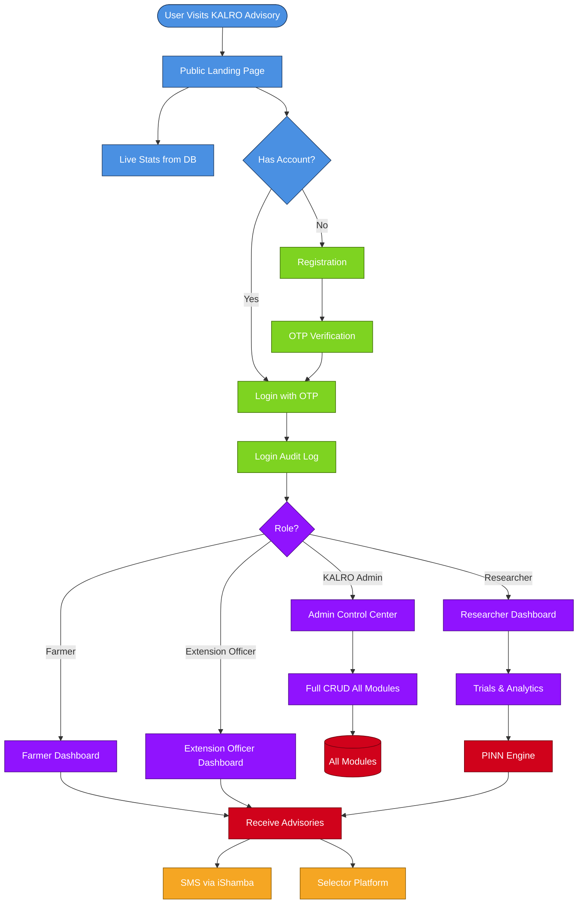
## 2. Registration, OTP & Login Flow
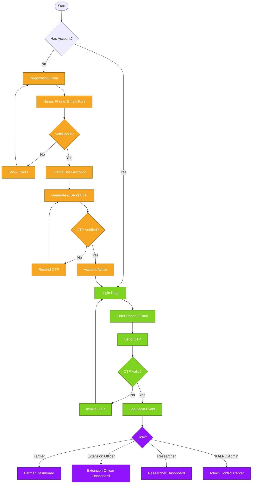
## 3. Farmer Flow
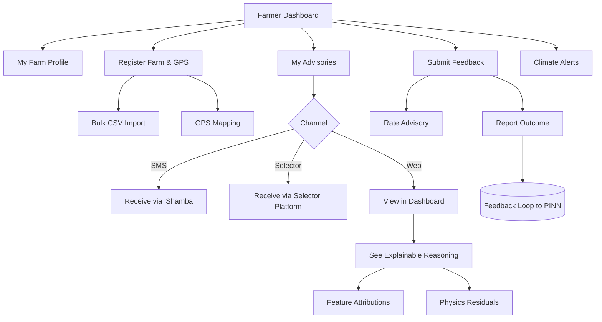
## 4. Extension Officer Flow
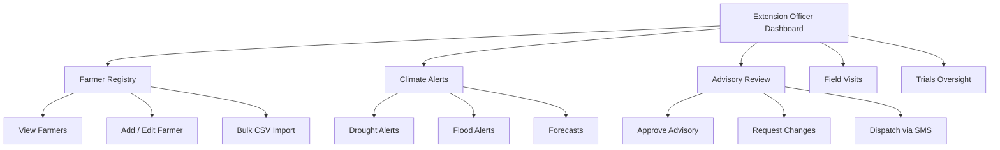
## 5. Researcher Flow
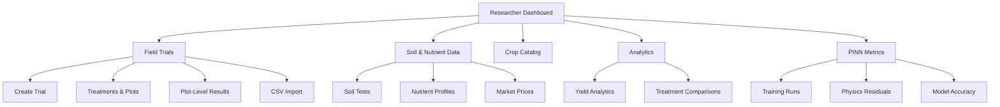
## 6. KALRO Admin Flow
```mermaid
flowchart TD
    A[Admin Control Center] --> B[Accounts]
    A --> C[Farmers]
    A --> D[Climate]
    A --> E[Soil]
    A --> F[Crops]
    A --> G[Trials]
    A --> H[PINN Engine]
    A --> I[Advisories]
    A --> J[Integrations]
    A --> K[Audit Logs]

    B --> B1[Users & Roles]
    B --> B2[OTP Management]
    B --> B3[Login Audit]

    C --> C1[Farmer Registry]
    C --> C2[Farms & GPS]
    C --> C3[Bulk Import]

    D --> D1[Weather Records]
    D --> D2[Forecasts]
    D --> D3[Alerts]
    D --> D4[KAOP Sync]

    E --> E1[Soil Tests]
    E --> E2[Nutrient Profiles]
    E --> E3[AgData Hub Sync]

    F --> F1[Crop Catalog]
    F --> F2[Growth Stages]
    F --> F3[Planting Calendars]
    F --> F4[PINN Parameters]

    G --> G1[Trials]
    G --> G2[Treatments]
    G --> G3[Plot Results]
    G --> G4[Analytics]

    H --> H1[PINN Models]
    H --> H2[Physics Constraints]
    H --> H3[Training Runs]
    H --> H4[Inference & Metrics]

    I --> I1[Generate Advisory]
    I --> I2[Approve]
    I --> I3[Deliver]
    I --> I4[Feedback Loop]

    J --> J1[Provider Configs]
    J --> J2[Sync Logs]
    J --> J3[Webhook Events]
    J --> J4[Provider Dashboards]

    classDef admin fill:#D0021B,stroke:#6B000D,color:#fff
    class A,B,C,D,E,F,G,H,I,J,K,B1,B2,B3,C1,C2,C3,D1,D2,D3,D4,E1,E2,E3,F1,F2,F3,F4,G1,G2,G3,G4,H1,H2,H3,H4,I1,I2,I3,I4,J1,J2,J3,J4 admin
```
## 7. PINN Engine Flow
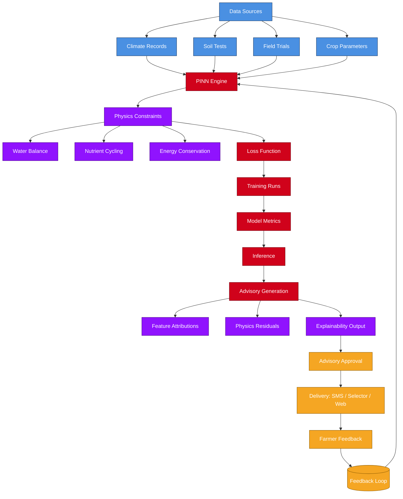
## 8. Advisory Lifecycle (Sequence)
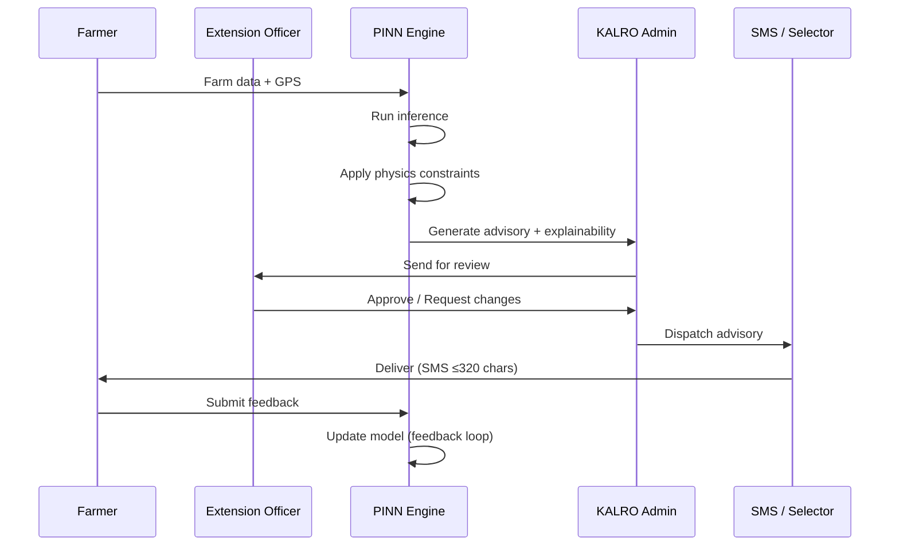
## 9. Integrations Flow
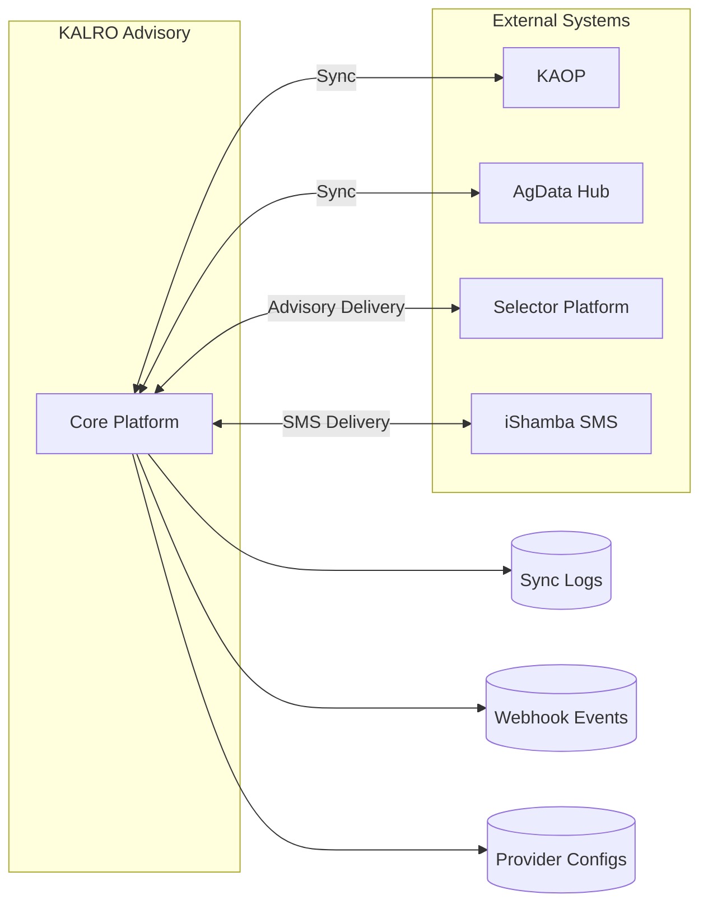
## 10. Module Architecture
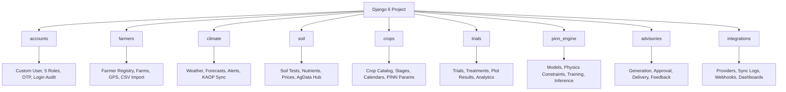
## 11. Permission Matrix
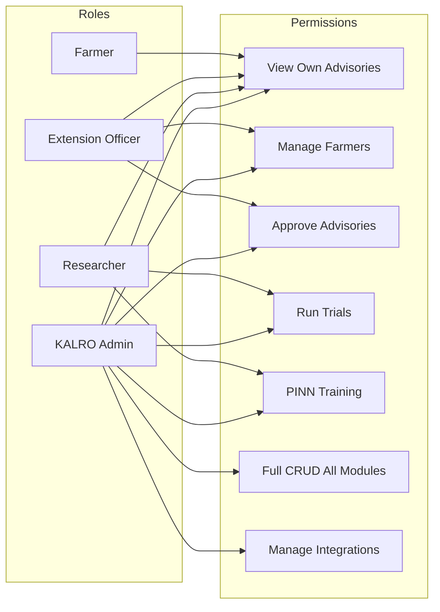

---

## Features

### Core platform
- **Role-based dashboards** for Farmers, Extension Officers, Researchers, and KALRO Admins
- **Public landing page** with live stats pulled from the database
- **Full CRUD** for every module via the admin Control Center — inline, no navigation away
- **Explainable reasoning** — feature attributions and physics residuals shown per advisory
- **SMS-ready** advisory text (≤ 320 chars) and delivery logging

### Modules
| Module | Purpose |
|--------|---------|
| `accounts` | Custom User model with 5 roles, OTP, login audit |
| `farmers` | Farmer registry, farms, GPS mapping, bulk CSV import |
| `climate` | Weather records, forecasts, drought / flood alerts, KAOP sync |
| `soil` | Soil tests, nutrient profiles, market prices, AgData Hub sync |
| `crops` | Crop catalog, growth stages, planting calendars, PINN parameters |
| `trials` | Field trials, treatments, plot-level results, analytics, CSV import |
| `pinn_engine` | PINN models, physics constraints, training runs, inference, metrics |
| `advisories` | Advisory generation, approval, delivery, feedback loop |
| `integrations` | Provider configs, sync logs, webhook events, per-provider dashboards |

---

## Tech Stack

- **Backend:** Django 6.0, Django REST Framework
- **Database:** SQLite (development) · PostgreSQL (production)
- **AI:** Physics-Informed Neural Network (PINN) — inference via background tasks
- **Task queue:** Celery + Redis (production); synchronous fallback in dev
- **Frontend:** Django templates · Bootstrap 5 · Chart.js · Leaflet
- **Static files:** WhiteNoise
- **Deployment:** Render (blueprint in `render.yaml`)

---

## Quick Start

### 1. Clone and set up

```bash
git clone https://github.com/eKidenge/kalro_advisory.git
cd kalro_advisory

python -m venv venv

# Windows
venv\Scripts\activate
# macOS / Linux
source venv/bin/activate

pip install -r requirements.txt
```

### 2. Configure environment

Create `.env` in the project root:

```
SECRET_KEY=change-me-to-a-long-random-string
DEBUG=True
ALLOWED_HOSTS=127.0.0.1,localhost

DJANGO_SUPERUSER_USERNAME=admin
DJANGO_SUPERUSER_EMAIL=admin@kalro.go.ke
DJANGO_SUPERUSER_PASSWORD=admin123
```

### 3. Migrate and seed

```bash
python manage.py migrate
python load_data.py
```

`load_data.py` seeds:
- 47 Kenyan counties
- 7 crop categories
- 20 common Kenyan crops
- 3 baseline physics constraints
- A superuser (from the `DJANGO_SUPERUSER_*` env vars)

### 4. Run

```bash
python manage.py runserver
```

Open `http://127.0.0.1:8000/`.

---

## Role-Based Access

| Role | Dashboard | Access |
|------|-----------|--------|
| **Farmer** | Own advisories & farm profile | Own data only |
| **Extension Officer** | County field data | Farmers, farms, soil, climate in their county |
| **Researcher** | Analytics, PINN models, trials | Nationwide read + model training |
| **KALRO Admin** | Full Control Center | Everything — user management, integrations, approvals |
| **System Admin** | Same as KALRO Admin | Superuser access |

---

## Deployment (Render)

The repository ships with `render.yaml` and `build.sh`.

1. Push to GitHub
2. Render dashboard → **New +** → **Blueprint**
3. Connect the repo → Render creates:
   - A web service (`kalro-advisory`)
   - A PostgreSQL database (`kalro-db`)
4. Set the secret env var in the Render dashboard:
   - `DJANGO_SUPERUSER_PASSWORD` — your chosen admin password
5. Click **Deploy**

First build: installs deps, migrates, collects static, creates the superuser.

---

## Project Structure

```
kalro_advisory/
├── kalro_advisory/         # project settings, urls, wsgi/asgi
├── apps/
│   ├── accounts/           # users, roles, auth, permissions
│   ├── farmers/            # farmers, farms, counties
│   ├── climate/            # weather, forecasts, alerts
│   ├── soil/               # soil tests, nutrient profiles, market prices
│   ├── crops/              # crops, growth stages, calendars
│   ├── trials/             # field trials, results, analytics
│   ├── pinn_engine/        # PINN models, physics, training, inference
│   ├── advisories/         # advisories, delivery, feedback
│   └── integrations/       # KAOP, AgData, Selector, iShamba
├── templates/              # project-wide templates
├── static/                 # CSS, JS, images
├── build.sh                # Render build script
├── render.yaml             # Render blueprint
├── requirements.txt
├── load_data.py            # Seed script
└── manage.py
```

---

## Roadmap

- [x] Django project, 9 apps, 100+ templates
- [x] Role-based auth, permissions, dashboards
- [x] Admin Control Center with inline CRUD for every module
- [x] Landing page with live DB stats
- [x] Production-ready settings (Postgres, WhiteNoise, security)
- [ ] Real PINN model training pipeline
- [ ] KAOP, AgData Hub, Selector, iShamba real API clients
- [ ] Celery + Redis background task queue
- [ ] REST API for mobile clients
- [ ] Full test coverage

---

## License

Proprietary — © Kenya Agricultural and Livestock Research Organization (KALRO).
All rights reserved.

---

## Contact

- **Repository:** https://github.com/eKidenge/kalro_advisory
- **Organization:** Kenya Agricultural and Livestock Research Organization
- **Email:** admin@kalro.go.ke
